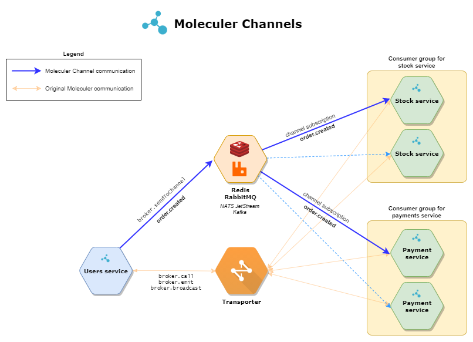
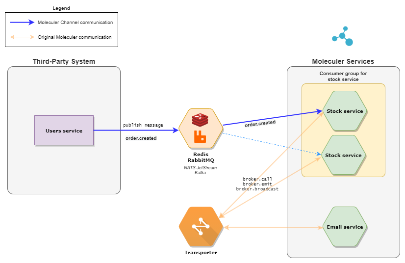
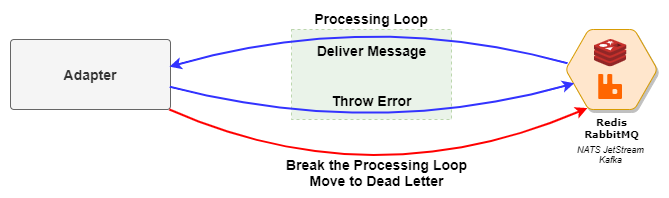
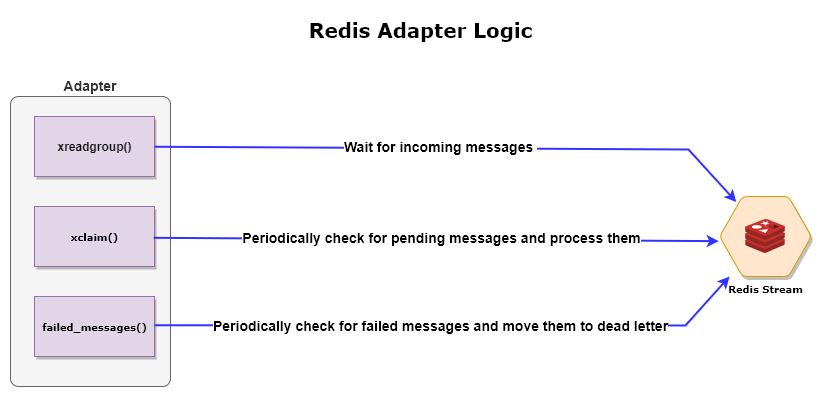

[](https://github.com/moleculerjs/moleculer-channels/actions/workflows/integration.yml)
[](https://coveralls.io/github/moleculerjs/moleculer-channels?branch=master)
[](https://snyk.io/test/github/moleculerjs/moleculer-channels)
[](https://www.npmjs.com/package/@moleculer/channels)

# @moleculer/channels

Reliable messages for Moleculer services via external queue/channel/topic. Unlike moleculer built-in events, this is **not** a fire-and-forget solution. It's a persistent, durable and reliable message sending solution. The module uses an external message queue/streaming server that stores messages until they are successfully processed. It supports consumer groups, which means that you can run multiple instances of consumer services, incoming messages will be balanced between them.

**This project is a work-in-progress. Don't use it in production.**

## Features

- reliable messages with acknowledgement.
- multiple adapters (Redis, RabbitMQ, NATS JetStream, Kafka).
- plugable adapters.
- configurable max-in-flight.
- retry messages.
- dead-letter topic function.
- can receive messages from 3rd party services.
- graceful stopping with active message tracking.

## Install

```
npm i @moleculer/channels
```

## Communication diagram

**Native Communication**



**Integration With A Third-Party System**


## Usage

### Register middleware in broker options

```js
// moleculer.config.js
const ChannelsMiddleware = require("@moleculer/channels").Middleware;

module.exports = {
    logger: true,

    middlewares: [
        ChannelsMiddleware({
            adapter: "redis://localhost:6379"
        })
    ]
};
```

By default, the middleware will add a `sendToChannel(<topic-name>, { payload })` method and `channelAdapter` property to the `broker` instance. Moreover, it will register handlers located in `channels` of a service schema.

### Consuming messages in Moleculer services

```js
module.exports = {
    name: "payments",

    actions: {
        /*...*/
    },

    channels: {
        // Shorthand format
        // In this case the consumer group is the service full name
        async "order.created"(payload) {
            // Do something with the payload
            // You should throw error if you want to NACK the message processing.
        },

        "payment.processed": {
            // Using custom consumer-group
            group: "other",
            async handler(payload) {
                // Do something with the payload
                // You should throw error if you want to NACK the message processing.
            }
        }
    },

    methods: {
        /*...*/
    }
};
```

>The received `payload` doesn't contain any Moleculer-specific data. It means you can use it to get messages from 3rd party topics/channels, as well.

### Producing messages

```js
broker.sendToChannel("order.created", {
    id: 1234,
    items: [
        /*...*/
    ]
});
```

>The sent message doesn't contain any Moleculer-specific data. It means you can use it to produce messages to 3rd party topics/channels, as well.

### Multiple adapters

**Registering multiple adapters**

```js
const ChannelsMiddleware = require("@moleculer/channels").Middleware;

// moleculer.config.js
module.exports = {
    logger: true,
    logLevel: "error",
    middlewares: [
        // Default options
        ChannelsMiddleware({
            adapter: {
                type: "Kafka",
                options: {}
            }
        }),
        ChannelsMiddleware({
            adapter: "Redis",
            schemaProperty: "redisChannels",
            sendMethodName: "sendToRedisChannel",
            adapterPropertyName: "redisAdapter"
        }),
        ChannelsMiddleware({
            adapter: "AMQP",
            schemaProperty: "amqpChannels",
            sendMethodName: "sendToAMQPChannel",
            adapterPropertyName: "amqpAdapter"
        })
    ]
};
```

**Using multiple adapters in a service**

```js
module.exports = {
    name: "payments",

    actions: {
        /*...*/
    },

    channels: {
        "default.options.topic": {
            group: "mygroup",
            async handler(payload) {
                /*...*/
            }
        }
    },
    redisChannels: {
        "redis.topic": {
            group: "mygroup",
            async handler(payload) {
                /*...*/
            }
        }
    },
    amqpChannels: {
        "amqp.topic": {
            group: "mygroup",
            async handler(payload) {
                /*...*/
            }
        }
    }
};
```

## Middleware options

| Name | Type | Default value | Description |
| ---- | ---- | ------------- | ----------- |
| `adapter` | `String`, `Object` | `null` | Adapter definition. It can be a `String` as name of the adapter or a connection string or an adapter definition `Object`. [More info](#adapters) |
| `schemaProperty` | `String` | `"channels"` | Name of the property in service schema. |
| `sendMethodName` | `String` | `"sendToChannel"` | Name of the method in ServiceBroker to send message to the channels. |
| `adapterPropertyName` | `String` | `"channelAdapter"` | Name of the property in ServiceBroker to access the `Adapter` instance directly. |

**Examples**
```js
// moleculer.config.js
const ChannelsMiddleware = require("@moleculer/channels").Middleware;

module.exports = {
    logger: true,

    middlewares: [
        ChannelsMiddleware({
            adapter: "redis://localhost:6379",
            sendMethodName: "sendToChannel",
            adapterPropertyName: "channelAdapter",
            schemaProperty: "channels"
        })
    ]
};
```

## Channel options

| Name | Type | Supported adapters | Description |
| ---- | ---- | ------------------ | ----------- |
| `group` | `String` | * | Group name. It's used as a consumer group in adapter. By default, it's the full name of service (with version) |
| `maxInFlight` | `Number` | Redis | Max number of messages under processing at the same time.
| `maxRetries` | `Number` | * | Maximum number of retries before sending the message to dead-letter-queue or drop. |
| `deadLettering.enabled` | `Boolean` | * | Enable "Dead-lettering" feature. |
| `deadLettering.queueName` | `String` | * | Name of dead-letter queue. |
| `handler` | `Function(payload: any, rawMessage: any)` | * | Channel handler function. It receives the payload at first parameter. The second parameter is a raw message which depends on the adapter. |
| `redis.startID` | `String` | Redis | Starting point when consumers fetch data from the consumer group. By default equals to `$`, i.e., consumers will only see new elements arriving in the stream. More info [here](https://redis.io/commands/XGROUP) |
| `redis.minIdleTime` | `Number` | Redis | Time (in milliseconds) after which pending messages are considered NACKed and should be claimed. Defaults to 1 hour. |
| `redis.claimInterval` | `Number` | Redis | Interval (in milliseconds) between message claims
| `redis.readTimeoutInterval` | `Number`| Redis | Maximum time (in milliseconds) while waiting for new messages. By default equals to 0, i.e., never timeout. More info [here](https://redis.io/commands/XREADGROUP#differences-between-xread-and-xreadgroup) |
| `redis.processingAttemptsInterval` | `Number` | Redis | Interval (in milliseconds) between message transfer into `FAILED_MESSAGES` channel |
| `amqp.queueOptions` | `Object` | AMQP | AMQP lib queue configuration. More info [here](http://www.squaremobius.net/amqp.node/channel_api.html#channel_assertQueue).
| `amqp.exchangeOptions` | `Object` | AMQP | AMQP lib exchange configuration. More info [here](http://www.squaremobius.net/amqp.node/channel_api.html#channel_assertExchange).
| `amqp.consumerOptions` | `Object` | AMQP | AMQP lib consume configuration. More info [here](http://www.squaremobius.net/amqp.node/channel_api.html#channel_consume).
| `nats.consumerOptions` | `Object` | NATS | NATS JetStream consumer configuration. More info [here](https://docs.nats.io/jetstream/concepts/consumers).
| `nats.streamConfig` | `Object` | NATS | NATS JetStream storage configuration. More info [here](https://docs.nats.io/jetstream/concepts/streams).
| `kafka.fromBeginning` | `Boolean` | Kafka | Kafka consumer `fromBeginning` option. More info [here](https://kafka.js.org/docs/consuming#frombeginning).
| `kafka.partitionsConsumedConcurrently` | `Number` | Kafka | Kafka consumer `partitionsConsumedConcurrently` option. More info [here](https://kafka.js.org/docs/consuming#partition-aware-concurrency).

## Failed message
If the service is not able to process a message, it should throw an `Error` inside the handler function. In case of error and if `maxRetries` option is a positive number, the adapter will redeliver the message to one of all consumers.
When the number of redelivering reaches the `maxRetries`, it will drop the message to avoid the 'retry-loop' effect.
If the dead-lettering feature is enabled with `deadLettering.enabled: true` option then the adapter will move the message into the `deadLettering.queueName` queue/topic.

**Dead-Letter Logic**



## Graceful stopping
The adapters track the messages that are being processed. This means that when a service or the broker is stopping the adapter will block the process and wait until all active messages are processed.

## Publishing
Use the `broker.sendToChannel(channelName, payload, opts)` method to send a message to a channel. The `payload` should be a serializable data.

### Method options

| Name | Type | Supported adapters | Description |
| ---- | ---- | ------------------ | ----------- |
| `raw` | `Boolean` | * | If truthy, the payload won't be serialized. |
| `persistent` | `Boolean` | AMQP | If truthy, the message will survive broker restarts provided it’s in a queue that also survives restarts. |
| `ttl` | `Number` | AMQP | If supplied, the message will be discarded from a queue once it’s been there longer than the given number of milliseconds. |
| `priority` | `Number` | AMQP | Priority of the message. |
| `correlationId` | `String` | AMQP | Request identifier. |
| `headers` | `Object` | AMQP, JetStream, Kafka, Redis | Application specific headers to be carried along with the message content. |
| `routingKey` | `Object` | AMQP | The AMQP `publish` method's second argument. If you want to send the message into an external queue instead of exchange, set the `channelName` to `""` and set the queue name to `routingKey` |
| `key` | `String` | Kafka | Key of Kafka message. |
| `partition` | `String` | Kafka | Partition of Kafka message. |
| `acks` | `Number` | Kafka | Control the number of required acks. |
| `timeout` | `Number` | Kafka | The time to await a response in ms. Default: `30000` |
| `compression` | `any` | Kafka | Compression codec. Default: `CompressionTypes.None` |

## Middleware hooks
It is possible to wrap the handlers and the send method in Moleculer middleware. The module defines two hooks to cover it. The `localChannel` hook is similar to [`localAction`](https://moleculer.services/docs/0.14/middlewares.html#localAction-next-action) but it wraps the channel handlers in service schema. The `sendToChannel` hook is similar to [`emit`](https://moleculer.services/docs/0.14/middlewares.html#emit-next) or [`broadcast`](https://moleculer.services/docs/0.14/middlewares.html#broadcast-next) but it wraps the `broker.sendToChannel` publisher method.

**Example**

```js
// moleculer.config.js
const ChannelsMiddleware = require("@moleculer/channels").Middleware;

const MyMiddleware = {
    name: "MyMiddleware",

    // Wrap the channel handlers
    localChannel(next, chan) {
        return async (msg, raw) => {
            this.logger.info(kleur.magenta(`  Before localChannel for '${chan.name}'`), msg);
            await next(msg, raw);
            this.logger.info(kleur.magenta(`  After localChannel for '${chan.name}'`), msg);
        };
    },

    // Wrap the `broker.sendToChannel` method
    sendToChannel(next) {
        return async (channelName, payload, opts) => {
            this.logger.info(kleur.yellow(`Before sendToChannel for '${channelName}'`), payload);
            await next(channelName, payload, opts);
            this.logger.info(kleur.yellow(`After sendToChannel for '${channelName}'`), payload);
        };
    }
};

module.exports = {
    logger: true,

    middlewares: [
        MyMiddleware,
        ChannelsMiddleware({
            adapter: "redis://localhost:6379"
        })
    ]
};
```

## Adapters

### Adapter options

| Name | Type | Default value | Supported adapters | Description |
| ---- | ---- | ------------- | ------------------ | ----------- |
| `consumerName` | `String` | ServiceBroker nodeID | * | Consumer name used by adapters. By default it's the nodeID of ServiceBroker. |
| `prefix` | `String` | ServiceBroker namespace | * | Prefix is used to separate topics between environments. By default, the prefix value is the namespace of the ServiceBroker. |
| `serializer` | `String`, `Object`, `Serializer` | `JSON` | * | Message serializer. You can use any [built-in serializer of Moleculer](https://moleculer.services/docs/0.14/networking.html#Serialization) or create a [custom one](https://moleculer.services/docs/0.14/networking.html#Custom-serializer). |
| `maxRetries` | `Number` | `3` | * | Maximum number of retries before sending the message to dead-letter-queue or drop. |
| `maxInFlight` | `Number` | `1` | * | Max number of messages under processing at the same time.
| `deadLettering.enabled` | `Boolean` | `false` | * | Enable "Dead-lettering" feature. |
| `deadLettering.queueName` | `String` | `FAILED_MESSAGES` | * | Name of dead-letter queue. |
| `redis` | `Object`, `String`, `Number` | `null` | Redis | Redis connection options. More info [here](https://github.com/luin/ioredis#connect-to-redis) |
| `redis.consumerOptions` `.readTimeoutInterval` | `Number`| `0` | Redis | Maximum time (in milliseconds) while waiting for new messages. By default equals to 0, i.e., never timeout. More info [here](https://redis.io/commands/XREADGROUP#differences-between-xread-and-xreadgroup)
| `redis.consumerOptions` `.minIdleTime` | `Number` | `60 * 60 * 1000` | Redis | Time (in milliseconds) after which pending messages are considered NACKed and should be claimed. Defaults to 1 hour.
| `redis.consumerOptions` `.claimInterval` | `Number` | `100` | Redis | Interval (in milliseconds) between message claims.
| `redis.consumerOptions` `.startID` | `String` | `$` | Redis | Starting point when consumers fetch data from the consumer group. By default equals to `$`, i.e., consumers will only see new elements arriving in the stream. More info [here](https://redis.io/commands/XGROUP).
| `redis.consumerOptions` `.processingAttemptsInterval` | `Number` | `0` | Redis | Interval (in milliseconds) between message transfer into `FAILED_MESSAGES` channel.
| `cluster` | `Object` | `null` | Redis | Redis cluster connection options. More info [here](https://github.com/luin/ioredis#cluster) |
| `cluster.nodes` | `Array` | `null` | Redis | Redis Cluster nodes list. |
| `cluster.clusterOptions` | `Object` | `null` | Redis | Redis Cluster options. |
| `amqp.url` | `String` | `null` | AMQP | Connection URI.
| `amqp.socketOptions` | `Object` | `null` | AMQP | AMQP lib socket configuration. More info [here](http://www.squaremobius.net/amqp.node/channel_api.html#connect).
| `amqp.queueOptions` | `Object` | `null` | AMQP | AMQP lib queue configuration. More info [here](http://www.squaremobius.net/amqp.node/channel_api.html#channel_assertQueue).
| `amqp.exchangeOptions` | `Object` | `null` | AMQP | AMQP lib exchange configuration. More info [here](http://www.squaremobius.net/amqp.node/channel_api.html#channel_assertExchange).
| `amqp.messageOptions` | `Object` | `null` | AMQP | AMQP lib message configuration. More info [here](http://www.squaremobius.net/amqp.node/channel_api.html#channel_publish).
| `amqp.consumerOptions` | `Object` | `null` | AMQP | AMQP lib consume configuration. More info [here](http://www.squaremobius.net/amqp.node/channel_api.html#channel_consume).
| `nats.streamConfig` | `Object` | `null` | NATS | NATS JetStream storage configuration. More info [here](https://docs.nats.io/jetstream/concepts/streams).
| `nats.consumerOptions` | `Object` | `null` | NATS | NATS JetStream consumer configuration. More info [here](https://docs.nats.io/jetstream/concepts/consumers).
| `kafka.brokers` | `String[]` | `null` | Kafka | Kafka bootstrap brokers.
| `kafka.logCreator` | `Function` | `null` | Kafka | Kafka logCreator. More info [here](https://kafka.js.org/docs/custom-logger).
| `kafka.producerOptions` | `Object` | `null` | Kafka | Kafka producer constructor configuration. More info [here](https://kafka.js.org/docs/producing#options).
| `kafka.consumerOptions` | `Object` | `null` | Kafka | Kafka consumer constructor configuration. More info [here](https://kafka.js.org/docs/consuming#options).


### Redis Streams

[Redis Streams](https://redis.io/topics/streams-intro) was introduced in Redis 5.0. Hoverer, since this module relies on the [XAUTOCLAIM](https://redis.io/commands/xautoclaim) command, Redis >= 6.2.0 is required.

>To use this adapter, install the `ioredis` module with npm install `ioredis` command.

**Redis Adapter Overview**



**Example**

```js
// moleculer.config.js
const ChannelsMiddleware = require("@moleculer/channels").Middleware;

module.exports = {
    middlewares: [
        ChannelsMiddleware({
            adapter: "redis://localhost:6379"
        })
    ]
};
```

**Example with options**

```js
// moleculer.config.js
const ChannelsMiddleware = require("@moleculer/channels").Middleware;

module.exports = {
    middlewares: [
        ChannelsMiddleware({
            adapter: {
                type: "Redis",
                options: {
                    redis: {
                        // ioredis constructor options: https://github.com/luin/ioredis#connect-to-redis
                        host: "127.0.0.1",
                        port: 6379,
                        db: 3,
                        password: "pass1234",
                        consumerOptions: {
                            // Timeout interval (in milliseconds) while waiting for new messages. By default never timeout
                            readTimeoutInterval: 0,
                            // Time (in milliseconds) after which pending messages are considered NACKed and should be claimed. Defaults to 1 hour.
                            minIdleTime: 5000,
                            // Interval (in milliseconds) between two claims
                            claimInterval: 100,
                            // "$" is a special ID. Consumers fetching data from the consumer group will only see new elements arriving in the stream.
                            // More info: https://redis.io/commands/XGROUP
                            startID: "$",
                            // Interval (in milliseconds) between message transfer into FAILED_MESSAGES channel
                            processingAttemptsInterval: 1000
                        }
                    },
                }
            }
        })
    ]
};
```

You can overwrite the default values in the handler definition.

**Overwrite default options in service**

```js
module.exports = {
    name: "payments",

    actions: {
        /*...*/
    },

    channels: {
        "order.created": {
            maxInFlight: 6,
            async handler(payload) {
                /*...*/
            }
        },
        "payment.processed": {
            redis: {
                minIdleTime: 10,
                claimInterval: 10
            }
            deadLettering: {
                enabled: true,
                queueName: "DEAD_LETTER"
            },
            async handler(payload) {
                /*...*/
            }
        }
    }
};
```

**Redis Cluster**
```js
module.exports = {
    middlewares: [
        ChannelsMiddleware({
            adapter: {
                type: "Redis",
                options: {
                    cluster: {
                        nodes: [
                            { port: 6380, host: "127.0.0.1" },
                            { port: 6381, host: "127.0.0.1" },
                            { port: 6382, host: "127.0.0.1" }
                        ],
                        options: { 
                            /* More information: https://github.com/luin/ioredis#cluster */ 
                            redisOptions: {
                                password: "fallback-password",
                            },                            
                        }
                    },
                    redis: {
                        consumerOptions: {
                            // Timeout interval (in milliseconds) while waiting for new messages. By default never timeout
                            readTimeoutInterval: 0,
                            // Time (in milliseconds) after which pending messages are considered NACKed and should be claimed. Defaults to 1 hour.
                            minIdleTime: 5000,
                            // Interval (in milliseconds) between two claims
                            claimInterval: 100,
                            // "$" is a special ID. Consumers fetching data from the consumer group will only see new elements arriving in the stream.
                            // More info: https://redis.io/commands/XGROUP
                            startID: "$",
                            // Interval (in milliseconds) between message transfer into FAILED_MESSAGES channel
                            processingAttemptsInterval: 1000
                        }
                    }
                }
            }
        })
    ]
};
```

### AMQP (RabbitMQ)

The AMQP adapter uses the exchange-queue logic of RabbitMQ for creating consumer groups. It means the `sendToChannel` method sends the message to the exchange and not for a queue. 

>To use this adapter, install the `amqplib` module with npm install `amqplib` command.

**Example**

```js
// moleculer.config.js
const ChannelsMiddleware = require("@moleculer/channels").Middleware;

module.exports = {
    middlewares: [
        ChannelsMiddleware({
            adapter: "amqp://localhost:5672"
        })
    ]
};
```

**Example with options**

```js
// moleculer.config.js
const ChannelsMiddleware = require("@moleculer/channels").Middleware;

module.exports = {
    middlewares: [
        ChannelsMiddleware({
            adapter: {
                type: "AMQP",
                options: {
                    amqp: {
                        url: "amqp://localhost:5672",
                        // Options for `Amqplib.connect`
                        socketOptions: {},
                        // Options for `assertQueue()`
                        queueOptions: {},
                        // Options for `assertExchange()`
                        exchangeOptions: {},
                        // Options for `channel.publish()`
                        messageOptions: {},
                        // Options for `channel.consume()`
                        consumerOptions: {}
                    },
                    maxInFlight: 10,
                    maxRetries: 3,
                    deadLettering: {
                        enabled: false,
                        //queueName: "DEAD_LETTER",
                        //exchangeName: "DEAD_LETTER"
                    }
                }
            }
        })
    ]
};
```

### Kafka

The Kafka adapter uses Apache Kafka topics.

> In Kafka adapter, the `maxInFlight` function works differently than other adapters. Reading messages from a partition is processed sequentially in order. So if you want to process multiple messages, you should read messages from multiple partition. To enable it, use the `kafka.partitionsConsumedConcurrently` option in channel options. [More info](https://kafka.js.org/docs/consuming#a-name-concurrent-processing-a-partition-aware-concurrency).

>To use this adapter, install the `kafkajs` module with npm install `kafkajs` command.

**Example**

```js
// moleculer.config.js
const ChannelsMiddleware = require("@moleculer/channels").Middleware;

module.exports = {
    middlewares: [
        ChannelsMiddleware({
            adapter: "kafka://localhost:9092"
        })
    ]
};
```

**Example with options**

```js
// moleculer.config.js
const ChannelsMiddleware = require("@moleculer/channels").Middleware;

module.exports = {
    middlewares: [
        ChannelsMiddleware({
            adapter: {
                type: "Kafka",
                options: {
                    kafka: {
                        brokers: ["kafka-1:9092", "kafka-1:9092"],
                        // Options for `producer()`
                        producerOptions: {},
                        // Options for `consumer()`
                        consumerOptions: {},
                    },
                    maxRetries: 3,
                    deadLettering: {
                        enabled: false,
                        queueName: "DEAD_LETTER",
                    }
                }
            }
        })
    ]
};
```


### NATS JetStream

>To use this adapter, install the `nats` module with npm install `nats` command.

```js
// moleculer.config.js
const ChannelsMiddleware = require("@moleculer/channels").Middleware;

module.exports = {
    middlewares: [
        ChannelsMiddleware({
            adapter: "nats://localhost:4222"
        })
    ]
};
```

**Example with options**
```js
// moleculer.config.js
const ChannelsMiddleware = require("@moleculer/channels").Middleware;

module.exports = {
    middlewares: [
        ChannelsMiddleware({
            adapter: {
                type: "NATS",
                options: {
                    nats: {
                        url: "nats://localhost:4222",
                        /** @type {ConnectionOptions} */
                        connectionOptions: {},
                        /** @type {StreamConfig} More info: https://docs.nats.io/jetstream/concepts/streams */
                        streamConfig: {},
                        /** @type {ConsumerOpts} More info: https://docs.nats.io/jetstream/concepts/consumers */
                        consumerOptions: {
                            config: {
                                // More info: https://docs.nats.io/jetstream/concepts/consumers#deliverpolicy-optstartseq-optstarttime
                                deliver_policy: "new",
                                // More info: https://docs.nats.io/jetstream/concepts/consumers#ackpolicy
                                ack_policy: "explicit",
                                // More info: https://docs.nats.io/jetstream/concepts/consumers#maxackpending
                                max_ack_pending: 1
                            }
                        }
                    },
                    maxInFlight: 10,
                    maxRetries: 3,
                    deadLettering: {
                        enabled: false,
                        queueName: "DEAD_LETTER"
                    }
                }
            }
        })
    ]
};
```

## Benchmark
>Tests are running on Intel i7 4770K, 32GB RAM on Windows 10 with WSL.

### Tested adapters
| Name | Adapter | Description |
| ---- | ------- | ------- |
| Redis | Redis | Simple Redis Stream adapter. |
| RedisCluster | Redis | Clustered Redis Stream adapter with 3 nodes. |
| AMQP | AMQP | AMQP adapter with RabbitMQ 3.8. |

### Latency test
In this test, we send one message at a time. After processing the current message, another one is sent. This test measures the latency of processing a message. The `maxInFlight` is `1`.

| Adapter | Time | msg/sec |
| -------------- | ----:| -------:|
| Redis | 2ms | 452 |
| RedisCluster | 2ms | 433 |
| AMQP | 51ms | 20 |
| NATS JetStream | 1ms | 584 |
| Kafka | 1ms | 637 |


### Throughput test (maxInFlight: 10)
In this test, we send 10k messages and wait for all be processed. This test measures the throughput. The `maxInFlight` is `10`.

| Adapter | msg/sec |
| -------------- | -------:|
| Redis | 1294 |
| RedisCluster | 4118 |
| AMQP | 11143 |
| NATS JetStream | 589 |
| Kafka | 1831 |


### Throughput test (maxInFlight: 100)
In this test, we send 10k messages and wait for all be processed. This test measures the throughput. The `maxInFlight` is `100`.

| Adapter | msg/sec |
| -------------- | -------:|
| Redis | 4081 |
| RedisCluster | 4198 |
| AMQP | 21438 |
| NATS JetStream | 646 |
| Kafka | 1916 |


## License

The project is available under the [MIT license](https://tldrlegal.com/license/mit-license).

## Contact

Copyright (c) 2021 MoleculerJS

[](https://github.com/moleculerjs) [](https://twitter.com/MoleculerJS)
